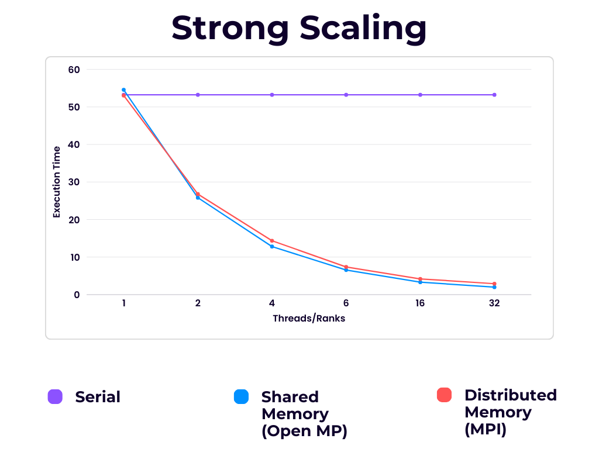
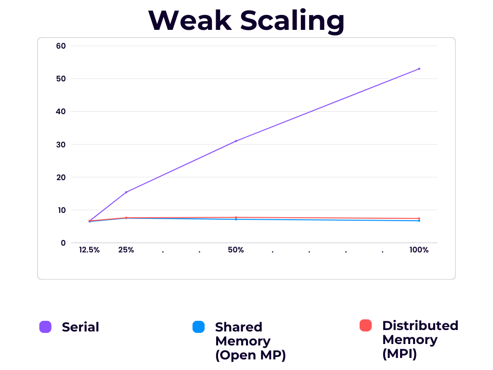

# Scaling Study

**_Serial vs Shared Memory CPU vs Distributed Memory CPU_**

---

### Strong Scaling Study (Fixed Problem Size)

For this strong study, we used `k = 8`, `tolerance=1e-4`, and used the full dataset. We also set `max_iterations=100`, though this threshold was never reached and has no bearing on the computation time.

This scaling study was ran on notch293

| Threads / Ranks | Serial Time (s) | Shared Memory (OpenMP) Time (s) | Distributed Memory (MPI) Time (s) | OpenMP Speedup | MPI Speedup | Shared Memory Efficiency (%) | Distributed memory Efficiency (%) |
| --------------- | --------------- | ------------------------------- | --------------------------------- | -------------- | ----------- | ---------------------------- | --------------------------------- |
| 1               | 53.223          | 54.5603                         | 53.035                            | 0.976          | 1.004       | 97.6                         | 100.40                            |
| 2               | 53.223          | 25.8225                         | 26.786                            | 2.061          | 1.987       | 103.1                        | 99.37                             |
| 4               | 53.223          | 12.809                          | 14.358                            | 4.156          | 3.708       | 103.9                        | 92.69                             |
| 8               | 53.223          | 6.558                           | 7.374                             | 8.117          | 7.219       | 101.5                        | 90.24                             |
| 16              | 53.223          | 3.310                           | 4.193                             | 16.082         | 12.696      | 100.51                       | 79.35                             |  
| 32              | 53.223          | 1.990                           | 2.912                             | 26.750         | 18.281      | 83.59                        | 57.13                             |

### Weak Scaling Study

For this week study, we used `k = 8`, `tolerance=1e-4`, and `max_iterations=100`, though this threshold was never reached and has no bearing on the computation time.

| Ranks/Threads | Data Points       | Serial (s) | OpenMP (s) | MPI (s) |
| ------------- | ----------------- | ---------- | ---------- | ------- |
| 1             | 12.5% / ~150,000  | 6.647      | 6.473      | 6.655   |
| 2             | 25% / ~300,000    | 15.409     | 7.532      | 7.624   |
| 4             | 50% / ~600,000    | 30.845     | 7.156      | 7.746   |
| 8             | 100% / ~1,200,000 | 53.223     | 6.724      | 7.405   |

### GPU Implementation Analysis

We tested both GPU implementations with the same dataset. Similar to CPU implementations the params were `k = 8`, `tolerance=1e-4`, and `max_terations=100`

#### SharedGPU Performance with Different Thread Block Sizes

| Thread Block Size | Execution Time (s) | Relative Performance |
| ----------------- | ------------------ | -------------------- |
| 128               | 1.310              | 0.76                 |
| 256               | 0.993              | 1.00                 |
| 1024              | 1.315              | 0.76                 |

#### GlobalGPU Performance with Different Thread Block Sizes

| Thread Block Size | Execution Time (s) | Relative Performance |
| ----------------- | ------------------ | -------------------- |
| 128               | 1.113              | 0.71                 |
| 256               | 0.787              | 1.00                 |
| 1024              | 1.123              | 0.70                 |

### Implementation Characteristics

Both GPU implementations converged successfully but with different iteration counts:

| Implementation | Thread Block Size | Iterations to Converge | Memory Usage |
| -------------- | ----------------- | ---------------------- | ------------ |
| SharedGPU      | 256               | ~50                    | -            |
| GlobalGPU      | 128               | 26                     | 7MB          |
| GlobalGPU      | 256               | 50                     | 7MB          |
| GlobalGPU      | 1024              | 46                     | 7MB          |

Findings GPU:

- We found that the block size for SharedGPU and GlobalGPU was ideal at 256 thread block sizes. This is as a result of the SM max size of 1024 threads per block. As we increased the number of blocks, the overall execution time increased since each SM couldn't fit nearly as much as the idea 256. Conversely, for smaller block sizes, the likelyhood of the reduced performance is due to too many block sizes in each SM.
